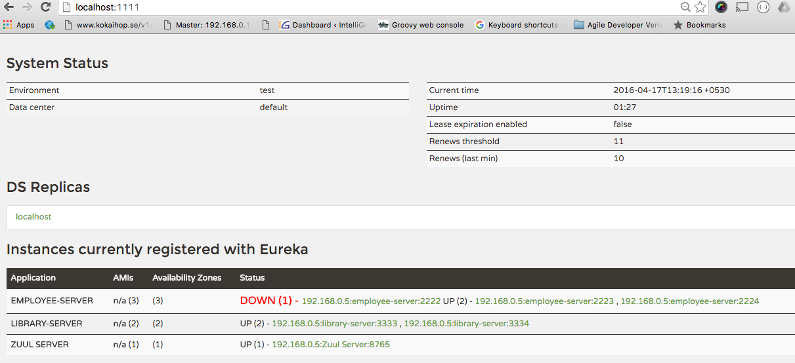
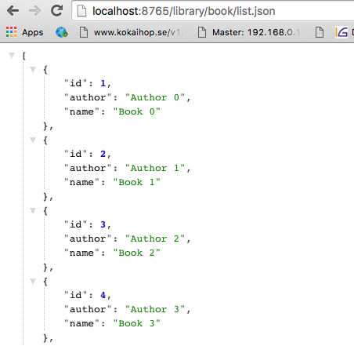

# Microservice

Contains sub projects required for managing microservices. Gradle multi project build will help you in opening all the projects in IntelliJIdea as well as build.

## Config Server

A central place to manage external properties for applications across all environments

```bash
cd config
./gradlew build
java -Dserver.port=8888 -jar build/libs/config-0.1.SNAPSHOT.jar
```

## Eureka Server

Service registry for resilient mid-tier load balancing and failover.

```bash
cd discovery
./gradlew build
java -Dserver.port=1111 -jar build/libs/discovery.jar
```

## Zuul Server

Gateway service that provides dynamic routing, monitoring, resiliency, security 

```bash
cd zuul
./gradlew build
java -Dserver.port=8765 -jar build/libs/zull-0.1.SNAPSHOT.jar
```

## Employee Service

Basic Spring boot application using MongoDB as persistent layer and provides REST endpoints for managing Employee Entity.

```bash
cd employee
./gradlew build
java -Dserver.port=2222 -jar build/libs/employee.jar  # instance 1
java -Dserver.port=2223 -jar build/libs/employee.jar  # instance 2
```

## Library Service

Grails 3.1.4 application with rest-api profile using MySql as persistent layer and provides REST endpoints for managing Book Entity.

```bash
cd employee
grails war
java -Dserver.port=3333 -jar build/libs/library-0.1.war # Instance 1
java -Dserver.port=3334 -jar build/libs/library-0.1.war # Instance 2
```
## Test it

### Eureka Dashboard

http://localhost:1111



### Test employee and library services using Zull Server

```bash
curl -XGET http://localhost:8765/employee/employee.json  #Zull server
curl -XGET http://localhost:2222/employee.json  #Employee server
```


```bash
curl -XGET http://localhost:8765/library/book/list.json   #Zull server
curl -XGET http://localhost:3333/book/list.json  #Library server
```


